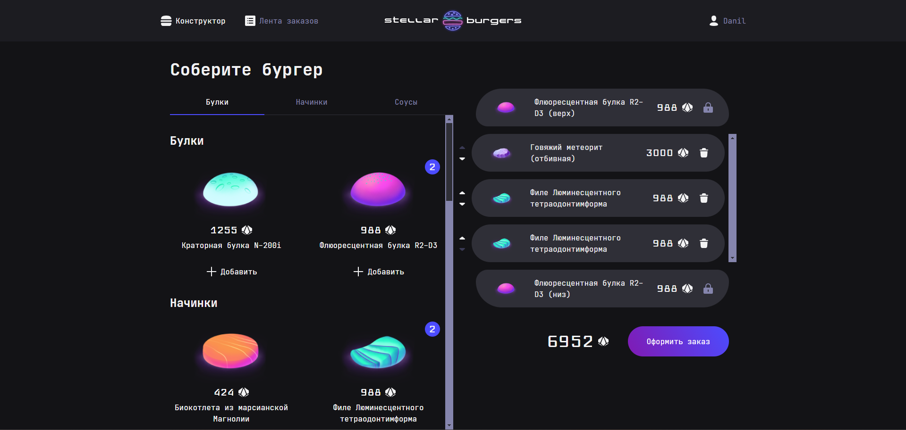

# Приложение Stella-burgers

[Макет](<https://www.figma.com/design/vIywAvqfkOIRWGOkfOnReY/React-Fullstack_-%D0%9F%D1%80%D0%BE%D0%B5%D0%BA%D1%82%D0%BD%D1%8B%D0%B5-%D0%B7%D0%B0%D0%B4%D0%B0%D1%87%D0%B8-(3-%D0%BC%D0%B5%D1%81%D1%8F%D1%86%D0%B0)_external_link?node-id=724-350&t=YumfKk0aBADOh4jc-4>)

[Ссылка на деплой](https://s0ldier3style.github.io/stellar-burgers)

---

### Функционал: 
- Регистрация пользователя 
- Аутентификация пользователя
- Смена пароля (на почту приходит письмо с кодом)
- Составление бургера в конструкторе с использованием булок и различных начинок 
- Отправка заказа на сервер
- В личном кабинете можно посмотреть данные о себе а также список ранее  заказанных бургеров
---

### Иcпользуемые технологии:
- Ипользуются функциональные компоненты на React
- В качестче стейт-менеджера используется Redux

### Инструкция по запуску
- Создайте папку для проекта и перейдите в неё.
- Склонируйте репозиторий `git clone https://github.com/s0ldier3style/stellar-burgers.git`
- Установите зависимости `npm install`
Запускайте проект `npm start`
---

## Важно:
Для корректной работы запросов к серверу необходимо добавить переменную BURGER_API_URL в окружение. Сама ссылка находится в файле `.env.example`.
